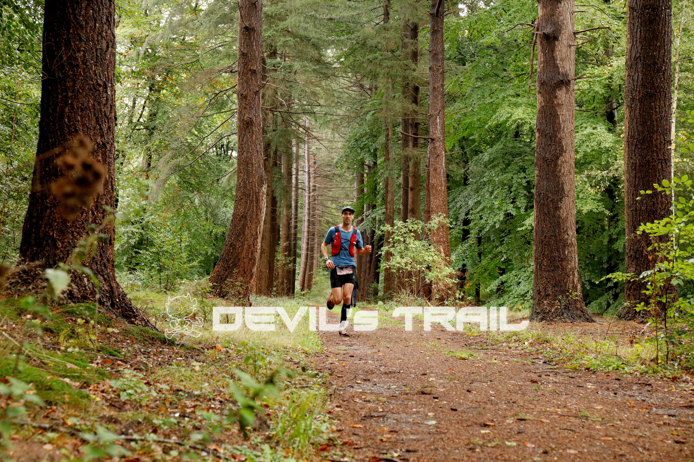
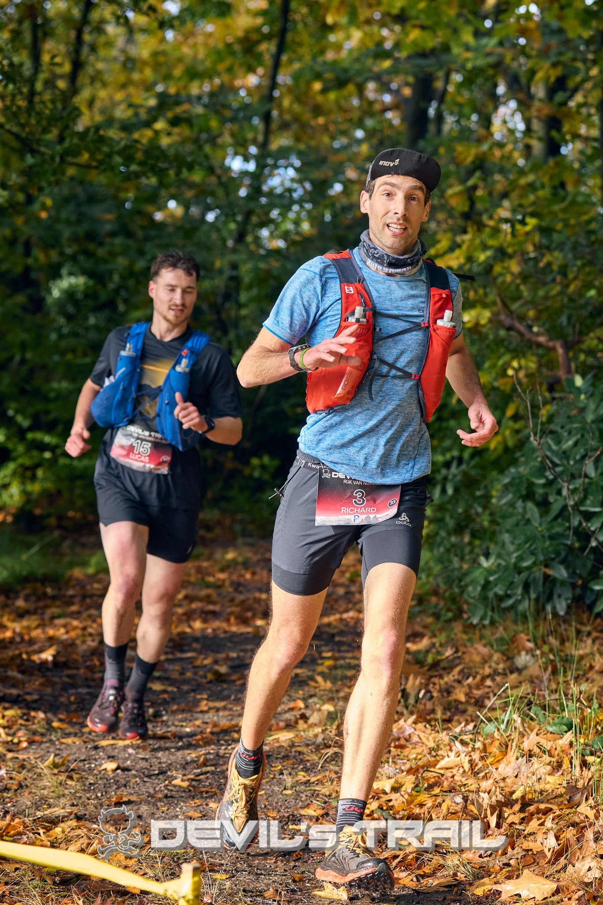
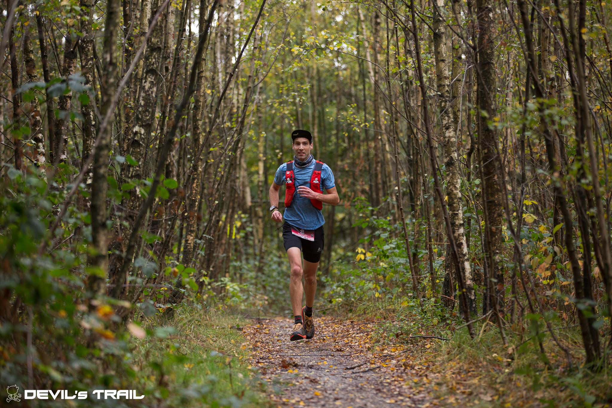

Winters weer zorgt voor een dun laagje sneeuw en een prachtige aanblik van het duingebied ten noorden van Castricum. Ik ben bezig aan de 60km van de Graef Castricum trail en dit is echt een cadeautje. Maar voordat we daar aankomen eerst wat over de rest van het najaar.

## Devil's trail Utrechtse Heuvelrug (36km)
De eerste wedstrijd van het najaar, begin oktober, is de [Devil's trail Utrechtse Heuvelrug](https://www.strava.com/activities/16040190069). Vorig jaar was de conditie matig zo kort na de geboorte van Iver. Daarom had ik al besloten toen de 25km te lopen, maar een griepje inclusief koorts in de week voorafgaand deed besluiten dat het uberhaupt verstandiger was niet te lopen. Dit jaar is de voorbereiding een stuk beter. De meeste loopjes blijven praktisch ingevuld, veel woon-werk verkeer, rondjes met de hond en/of kinderwagen. Maar toch zat er ook een training van [meer dan 30km](https://www.strava.com/activities/15884865542) in dit keer, wel met Willow maar die verdroeg de blokjes goed. Had alleen na de derde 5km wat water nodig.

Goed, een stuk beter voorbereid aan de start dus. De groep was wat groter, want door de harde wind was de 24-uurs ultra afgelast en starten er dus een aantal deelnemers op de lange trail. Ik twijfelde nog even over een regenjack, maar besloot toch om alleen in een merino shirt te starten en dat was een goede keuze. Er viel ook eigenlijk geen regen tijdens de race. Er werd voor mijn gevoel rustig gestart en bovenaan de zandheuvel van het Doornse gat liep ik al vooraan, en eigenlijk ook gelijk alleen. En zo verliep de rest van de race. Ik zag niemand voor mij (behalve wat 25km lopers op het eind) en niemand achter mij. Het tempo zakte op het laatst wel wat in, maar dat was te verwachten met gebrek aan langere duurlopen. Ondanks dat ik de hele weg alleen heb gelopen, blijkt de voorsprong aan het eind op de nummer twee slechts ongeveer anderhalve minuut. Goed dat ik niet teveel heb omgekeken.

## Devil's trail Rijk van Nijmegen (33km)
De tweede wedstrijd is eind oktober, [Devil's trail rijk van Nijmegen](https://www.strava.com/activities/16261189837). Het parcours is wat veranderd ten opzichte van eerdere jaren dus extra reden om het kaartje maar even goed te bestuderen, want twee jaar terug liep ik na een kilometer of vijftien verkeerd en dat koste flink wat tijd en extra kilometers. Het verloop lijkt een beetje op dat in Utrecht. Er wordt hier iets harder gestart maar binnen twee kilometer loop ik toch weer voorop. Grote verschil is dat ik dit keer iemand mee krijg. De eerste lus lopen we aardig samen op, maar dan pak ik na een kleine 10km toch wat voorsprong. Die bouwt beetje bij beetje uit tot ik na een kilometer of 20 toch weer niemand achter me zie. Mooi, denk ik dan. Gewoon door blijven lopen zoals het nu gaat en dan win je deze wedstrijd ook. Ik loop weer in dat merino shirt, maar we krijgen een fikse bui over ons heen en ik koel flink af. Mijn vingers zijn vooral erg koud. Het tempo zakt ook wat in en de nummer twee in de race krijgt mij toch weer in het vizier. Dit heb ik door zo'n 5km voor het einde. We zijn net weg weer overgestoken, het loopt lang rechtdoor naar beneden, de andere afstanden hebben een andere afslag genomen en ik hoor iemand achter mij. Ik houd wat in en hij vindt zo'n 3km voor het einde de aansluiting. Ik ben wel wat moe, als hij door zou trekken weet ik niet of ik aan kan haken, maar dat doet hij niet. Sterker, het tempo blijft gelijk aan wat ik vlak daavoor liep dus prima dan ga ik in zijn rug lopen en een plan bedenken. Wachten op de sprint of eerder gaan? Op een heuveltje overweeg ik nog een keer te demareren, maar ik ben bang dat het te ver is en ik het op het vlakke weer verlies. Plus er is de kans om mijn benen op te blazen. Dan toch maar wachten op de sprint. Vlak voor de finish is er een haakse bocht naar links, dat weet ik. Dus ik wacht, en wacht tot zo'n 200m voor de finish en dan vertrek ik uit zijn rug. Ik heb een gaat, maar het wordt niet snel groter. Ik ga als eerste de laatste bocht in en dan is het nog een paar meter. Als dit een wielerwedstrijd is dan doe ik het tactisch goed. Het is glibberen en ik kom maar matig op gang uit de bocht. Er liggen twee matten, de eerste ben ik nog als eerste, maar op de tweede - de finishmat - wordt ik toch geklopt. Wat zal het schelen? Niet veel. Tweede plek, ik kan er niet van balen, dat was een leuke race op het einde.

<!-- :-------------------------:|:-------------------------:
 |  -->

  
  
  <figcaption>Left: &copy; Rinus Luijmes; Right: &copy; Ted van Aanholt</figcaption> 

## Graef Castricum Trail (33km)
De week na de trail in Nijmegen zou ik nog een 10km lopen bij de startbaanloop in Soesterberg. Echter, ik heb last gekregen van mijn rechterknie. Ik denk een overbelaste pees. Rennen gaat wel, maar op hogere tempo's doet het wat zeer. Ook ver buigen is niet prettig. Dus besloten het niet te forceren en niet te lopen daar. Ik blijf wel lopen. Ik koel de knie met een icepack, krijg voor mijn verjaardag een kniecompressiekous en pak de foam rol er ook maar weer bij. Het komt denk ik vanuit mijn bil, want die trekt bij hogere inspanning steeds ook een beetje. Desondanks blijf ik wel lopen. Wederom vaak zo rond een uur, maar het lukt wel om ondanks de knie twee weken te maken van zo'n 90km.

De twee weken voor de Graef Castricum trail is de knie bijna weg en kan ik zelfs wat tempo blokken inbouwen. Eerst voorzichtig, later ook wat langer en die gaan best goed. De knie reageert wel een beetje, maar met de kous, foam rol en icepack gaat het ook steeds snel weer weg. 

Dus sta ik op 23 november met een goed gevoel op. De dagen ervoor was de slaap wat minder,dus was ik bang dat ik al uitgeput aan de start zou staan. Maar de laatste twee nachten was het wel weer OK. Het is 05.00 als de wekker gaat, en rond 06.10 als ik vertrek van huis. De weg is bedekt met sneeuw en op de snelweg is slecht gestrooid (ik denk één baan). Ik heb nog zomerbanden onder de auto liggen, dus oppassen. Toch ben ik aardig op tijd in Castricum, en ik was goed voorbereid want alles was al gereed bij het opstaan inclusief softflaks in het vestje. Qua kleding, de temperatuur ligt rond het vriespunt, start ik in lange broek, merino onderlaag, t-shirt, armstukken en een buff. 

Ik heb een raceplan vandaag, en dat is niet te hard starten. Rond de 5.00/km moet ik toch kunnen lopen, dus het plan is om ongeveer op dat tempo te lopen en dan kijken of ik aan het eind nog wat kan versnellen. De nummer twee van de Devil's trail in Utrecht loopt ook mee en die start hard dit keer. Zo snel dat ik hem binnen de korste keren niet meer zie. Ik begin rustig en loop op plek drie, een kort stukje achter nummer twee. Zo gaat het een paar kilometer totdat ik naast de nummer twee kom te lopen en vervolgens er voorbij. Er lopen nu drie man een kort stukje achter mij maar die verdwijnen langzaam uit beeld. Het eerste stuk gaat lekker en de omgeving is prachtig met besneeuwde bossen en besneeuwde duinen. Vanaf 15km is het 25km op GPX lopen. Ik houd mij nog steeds aan mijn plan, rustig lopen tot ver in de tweede helft van de race. Het is wel koud en ik heb niet mega veel trek, mijn voedingsplan is nu elk uur één gel en één stuk vast voedsel en elke 3km een paar slokken sportdrank. Mijn sportdrank is trouwens al maanden over datum. De gels niet, bij eerdere races dit jaar nog wel maar die zijn inmiddels op. Ik heb verder drie quesedillas mee en twee snelle jelle repen. Bij de post rond 25km zie ik opeens de leider in de race. Omdat ik niet stop gaan we praktisch gelijk weg bij deze fouragepost. Eigenlijk loopt hij gelijk weer bij mij weg. In plaats van volgen besluit ik gewoon door te lopen zoals het gaat, want dat gaat prima tot nu toe. 

Op het noordelijkste punt draaien we om en gaan we door de duinen weer terug. Vanaf hier is het ongeveer 20km tegen de wind in met ook twee strand passages. Er zitten pittige stukken in door mul zand in de duinen, en soms moet er ook best geklommen worden tegen de de duinen. 

Na de eerste van deze strandpassages beginnen de route pijlen weer en voegt onze route zich samen met die van de 35km. Ik twijfel of ik bij de strandafgang de koploper nog zie. Wel word ik gelijk ingehaald, maar dat is een 35km loper (overigens de enige die mij nog inhaalt). Het is wel zwaar aan het worden. Ik heb het koud gekregen, maar geen zin om een regenjack extra aan te trekken. Het eten gaat lastiger en vast voedsel sla ik toch over. En ik zie een beetje wazig. Ik twijfel waardoor dit komt? Hongerklop? Of de koude? Mijn hoofd voelt ook een beetje alsof ik te snel ijs eet, maar ik kan me er niet toe zetten om de buff van mijn nek om mijn voorhoofd te doen. Bij de tweede strandpassage zit ik inmiddels in vol verkeer van de 23km. Wanneer we het strand afgaan is het een stukje pittig klimmen door mul zand en die kilometer gaat dus ook in een kleine zes minuten. Maar daarna lopen we in oostelijke richtig en staat de wind niet meer tegen. Ik kan het tempo gelijk wat opschroeven en er is nog maar 10km te gaan. De 35km en 60km route splitst zich weer af van de 23km route en ik loop weer helemaal alleen. Het gaat nu eigenlijk best lekker, maar ik heb geen idee wat mijn achterstand is op de leider (of voorsprong op de nummer drie). Ik besluit gewoon maar aardig door te lopen. Dat wazig zien is ook voorbij dus dat zal dan toch de koude geweest zijn. En zo gaat het tot de finish. Alleen nog een heel steile trap vertraagd het tempo nog even, maar verder loop ik lekker. De leider zie ik niet meer terug, maar plek twee is binnen. Op de atletiekbaan van AV Castricum kan ik (voor mijn gevoel) nog lekker en soepel een aardig tempo lopen en zo kom ik tevreden over de [finish in een kleine 4u54min](https://www.strava.com/activities/16542915427). Raceplan goed uitgevoerd en lekker vooraan mee kunnen doen. Waar nog wat te verbeteren valt is toch de kledingkeuze, een muts had misschien ervoor gezorgd dat ik mij tussen kilometer veertig en vijftig wat beter had gevoeld. En die quesedillas, ik heb er uiteindelijk maar eentje opgegeten, de snelle jelles vielen beter. De winnaar zit uiteindelijk ruim vier minuten voor mij. Hij had ook het laatste stuk flink doorgelopen zei hij, want hij had tactisch op de tracking app gekeken en gezien dat het verschil niet heel groot was.

## Nawoord
Het herstel na de race valt niet tegen. Geen heel erge spierpijn en op woensdag ga ik twee keer lopen. Op zaterdag is het plan met Iver in de kar en Willow te gaan lopen in de ochtend. Stephan gaat ook en die stelt 1200m tempo's voor. Met barefootschoenen (gebruik ik normaal niet met tempo's) hond, kar en uiteindelijk zelfs twee kinderen, tempo's? Ok laten we het eens proberen. En die gaan eigenlijk verrassend goed. We doen 7x1200m langs de Treekerlaan. Dus binnen een week prima hersteld en geleerd dat je met hond en kinderwagen prima tempo blokken kan doen. at beloofd wat voor de volgende volgende zestig kilometer, op Texel eind Maart.
