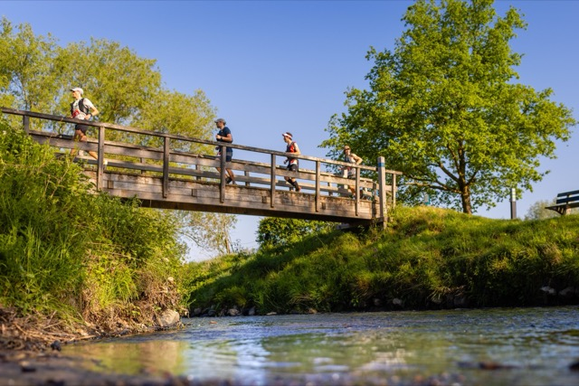
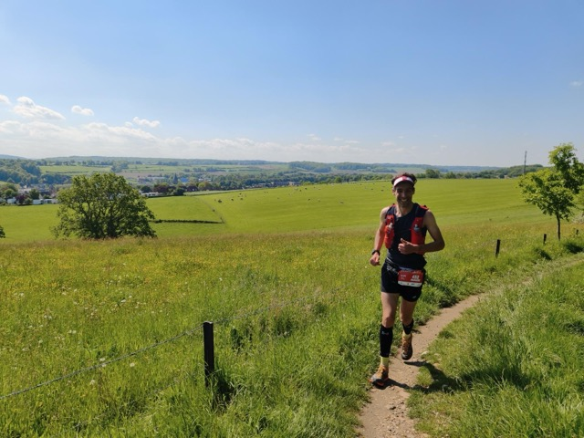

De Koning van Spanje trail (KVS) stond al een tijde op mijn lijstje maar in voorgaande jaren waren we telkens op vakantie.
Dit jaar komt het er wel van. Dus reis ik samen met Tera en Willow op vrijdagmiddag richting Vijlen waar we in een B&B overnachten.
Het is ons eerste nachtje samen weg sinds de geboorte van Iver, dus dat is ook bijzonder.
We nemen het ervan en gaan, na een wat lange reis door files, in Vaals uiteten bij de Italiaan waar we 3 jaar geleden ook aleens hebben gegeten.
Voor een lange race eet ik het liefst niet al teveel en iets dat licht verteerbaar is. Ditmaal is het een Pizza Vegetariana (met ananas?).
Na het eten naar onze kamer en dan nog een rondje met de hond. Vijlen in de avondschemering is prachtig en ik vind het jammer dat ik 
niet zovel van de omgeving zal zien. Want hierna is het optijd naar bed en vroeg op.

Dat optijd naar bed lukt best aardig, maar slapen gaat toch een stukje minder. Ik ben een beetje onrustig, niet gek de dag voor een lange race.
Het jammere is dat ik de nachten ervoor ook niet heel best heb geslapen. Tekort vooral, eigen schuld, ging te laat naar bed. 
De wekker gaat vervolgens om 04.05 en mijn Garmin ochtendrapport zegt op dat moment "You may feel very tired today".
Maar rustig opstaan, twee kopjes koffie drinken en wat boterhammen met pure chocopasta eten doen mij erg goed, en ik voel me een frisser dan dat mijn horloge denkt.
De voorbereiding gisteren was prima. Bidon en softflasks heb ik thuis al gevuld en 
gisteravond heb ik nog gels, snelle jelle's en quesadilla's verdeeld over mijn vest en twee zakjes die Tera mee kan nemen om mij aan te geven op de rust punten.
Ze heeft één extra softflask mee en verder ben ik van plan drinken van de organisatie te nemen. 
Dat doe ik meestal niet, vaak neem ik ook nog een drinkzak mee, voldoende voor de hele race. Maar ik wil het een keer proberen.
Tera maak ik wat later wakker en als alle ochtendrituelen zijn afgerond en mijn tas weer is ingepakt vertrekken we richting de start.

Het beloofd een mooie dag te worden. 's Ochtends is het nog fris (zo rond de 4 graden) maar later zal het zonnig worden en rond de 20 graden.
Ik start met armstukken, een hemd en een t-shirt. Tera en Willow zijn mee om ons om 06.00 uit te zwaaien.

Het begint gelijk heuvelop en vrij rustig. Fijn dat is ook mijn plan. Vaak gaan races waar ik rustig start uiteindelijk beter.
De voorbereiding voor dit evenement was prima, maar ik had bij mijn laatste race, de zestig van Texel, wel een beetje een mentale klap gekregen.
In de aanloop naar die race ging het aanvankelijk super, maar door ziekte in de weken voorafgaand moest ik al de 3bergenloop missen 
en ook in de week voor de race was ik weer ziek. Toen was het vooral hoesten als een zeehond. Op de dag zelf, na ook een matige nacht, was daar nog een kuchje vanover.
De race verliep aanvankelijk goed, maar eenmaal aan de oostkant van het eiland kreeg ik het toch erg zwaar. 
Ook hier was Tera erbij, als fietsbegeleider, en dat was fijn want ik kon wel wat support gebruiken.
De marathon doorkomst ging nog rond de 3 uur maar daarna was de tank helemaal leeg. Het werd ook bewolkt en met 
windkracht 6 tegen kreeg ik het koud en moest zelfs een thermoshirt extra aantrekken. Na 4.43.05 kwam ik over de streep.
Ondanks dat dit niet was waarvoor ik was gekomen was ik toch voldaan en was het een fijne dag samen. 
Tera heeft overigens ook een top prestatie geleverd want haar fietsaccu was leeg na 40km. En toen moest ze nog tegen de wind terug naar den Burg en vervolgens naar de boot!
Na de zestig van Texel was mijn langste loop een 28km de zondag voor koningsdag rond 4u in de ochtend (met licht van de telefoon, want mijn hoofdlamp bleek stuk).
Gezien deze voorgeschiedenis leek niet overenthousiast starten een goed idee.

De ochtend is heerlijk. Al gauw lopen we met een groepje van een man of acht voorop. Ik geniet van het heerlijke weer
en de prachtige omgeving. Zelfs een steentje in mijn schoen stoort me niet. Of misschien beelde ik het mij alleen maar in want even later 
heb ik daar geen last meer van. Ik schommel een beetje door de groep heen, dan weer wat verder van voren dan weer wat verder achteraan.
Bij de eerste post staat Tera. Het wordt al warm dus de armstukken gaan maar gelijk uit.
En zo gaan we verder, de groep blijft compleet maar nu bungel ik toch steeds vaker wat achteraan.
Dat is prima, ik ga mijn eigen tempo lopen en de eerste helft van de race wordt vooral sparen.
Inmiddels is het zo warm dat bij de tweede stop na zo'n 25km ook mijn t-shirt uitgaat en ik van Tera zonnebrand krijg.
Hier wissel ik ook de eerste softflask en neem wat nieuwe gels aan. Ik hoor een 
andere loper zeggen dat het "Lekker gaat maar wel wat sneller dan gepland". Bij mij voelt het nog allemaal heel gemakkelijk dus dat zit goed.
Het weglopen bij de fouragepost zorgt voor wat verwarring en daardoor loop ik samen met een andere loper eerst het verkeerde pad in. Daarna vinden we toch het goede pad
en vervolgen we onze weg. Een klein groepje is sneller vertrokken en zie ik inmiddels ook niet meer. 
Dus nu zijn wij de nummers 4 t/m 8 in de race.

Bij de derde post vul ik één softflask met sportdrank vanuit de organisatie, eet twee tuc's en ga weer op pad.
Tera is hier niet, die is lekker ontbijten bij de B&B die vlak in de buurt was van de tweede fouragepost. 
Het ontbijt was vanaf 08.30 dus dat kwam ongeveer perfect uit met mijn doorkomst aldaar. Stiekem ben ik wel een beetje jaloers.

Ik merk dat ik vooral omhoog relatief snel loop, en naar beneden steeds weer wat terrein verlies op de andere lopers.
Het doel is om alles omhoog te blijven rennen. Dat gaat niet hard, maar zelfs rustig rennen lijkt toch sneller te gaan dan wandelen of power hiken.
Ergens tussen de derde en de vierde post raken we één iemand kwijt. We lopen nu nog met vier man samen,
Johnno, Peter, Gijs en ik op plek 4 t/m 7. 
Ik zie iemand ergens een gel verpakking verliezen, kijk om en zie Peter deze oprapen.
Precies zoals het hoort, dan heb je de karma punten wel verdient! Later zal ik nog heel veel met Peter samen oplopen.

Na ongeveer een marathon versnelt Johnno en vlak voor de vierde stop halen we naar wat blijkt één van de oorspronkelijke koplopers in.
Als ik bij de bevoorrading na ongeveer 60km aankom zie ik net iemand bij de post weglopen. 
Dat blijkt de nummer twee in de race te zijn en de laatst overgebleven van de oorspronkelijke koplopers. Eentje is er dus tussenuit gevallen
zonder dat ik dat door heb gehad. Tera geeft aan dat ik 10min achter de koploper zit, dat betekent dus dat ik in ongeveer 20km 10min achterstand heb
opgelopen zonder echt langzamer te zijn gaan lopen.

Kort na de ravito halen Peter en ik de nummer twee in en vanaf daar jojo'en we richting het eind. Peter loopt harder op het vlakke en naar beneden,
ik boek terreinwinst omhoog. Bij de laatste stop, op zo'n 7km van de finish, is de achterstand om Johno nog steeds zo'n 10 minuten. Ik vraag aan Tera hoever 
de nummer vier achter ons ligt, en ze zegt tenminste vier minuten (want ze kan hem nog niet zien aankomen). Dat lijkt mij dus een gedane
zaak want ik voel me nog prima en het tempo ga ik zeker vasthouden. Nog wat extra cola erin (dat drink ik veel met dit warme weer) en door.
Het onderweg bijvullen in plaats van alleen eigen sportdrank is mij overigens prima bevallen. Het hielp ook dat ik al twee kant-en-klare zakjes met voeding aan Tera had gegeven.

Het laatste stuk loop ik samen op met Peter. Onderweg help je elkaar een beetje. We komen onder andere nog door een donker tunneltje langs een lager gelegen stroompje en dat voelt na
bijna 8 uur op de benen toch een beetje wankel. Met nog minder dan 3km te gaan kijkt Peter om en zegt dat er iemand achter ons loopt.
Ik kan me haast niet voorstellen dat het iemand van de 85km is, maar dat blijkt wel het geval te zijn. Peter herkent Gijs en die zit ons op de hielen.
Die heeft goed doorgelopen de laatste kilometers, want ons tempo is nog steeds vlak. Gelukkig voel ik dat er nog wat in de tank zit en vraag aan Peter of hij ook
nog wat over heeft. Hij geeft een bevestigend antwoord en dan versnel ik. We trekken flink door, vooral op de Gulperberg de laatste klim van de dag. Als ik daar omkijk zie ik niemand meer achter ons.
Bovenop de heuvel door blijven trekken en dan rechtsaf naar beneden. Het laatste stuk gaat omlaag dus ik zeg tegen Peter dat hij moet gaan want omlaag ga ik het toch afleggen,
maar dat maakt niet uit want ik ben allang blij dat we samen het podium gehaald hebben na dit spannende laatste stukje. 
Zo'n hele dag samen oplopen werkt erg verbindend.

Bij de finish zie ik Tera en kan ik even uitpuffen. Een paar minuten later finisht ook Gijs en Johno staat ook nog bij de finish. Hij blijkt
uiteindelijk nog wat pittige laatste kilometers te hebben gehad en de voorsprong was geslonken tot minder dan vier minuten. Met z'n vieren praten we
na over een mooie dag buitenspelen. Ik neem een stuk vlaai en een (alcoholvrij) biertje. De prijsuitreiking volgt al vrij vlot en daarna gaan we ook direct 
weer door naar huis. Met nog een kleine stop bij de McDonalds voor koffie en ijs zijn we evengoed precies op tijd thuis om de jongens nog op bed te leggen.

Nog een leuk stuk in de [plaatselijke krant van Best](https://www.groeiendbest.nl/static/9/Groeiend-Best?date=20260519&page=21)

[Strava activiteit](https://www.strava.com/activities/18437754672)

